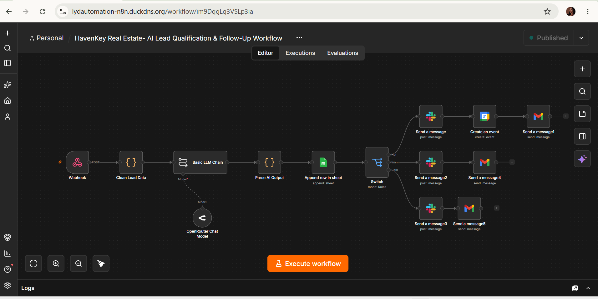
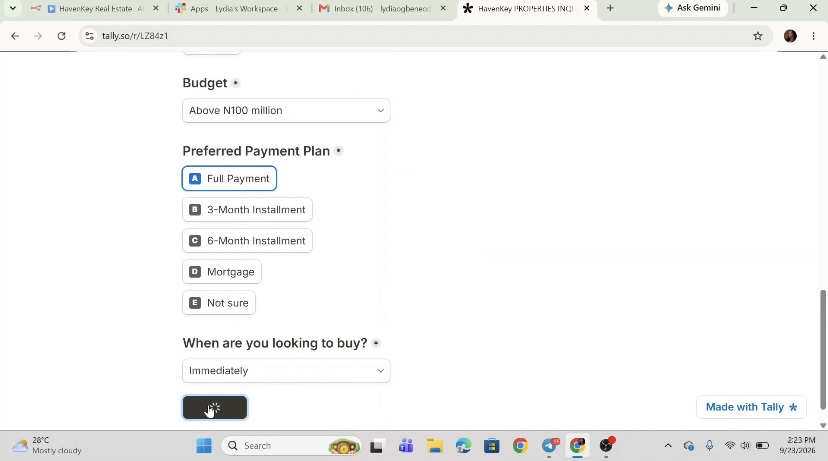
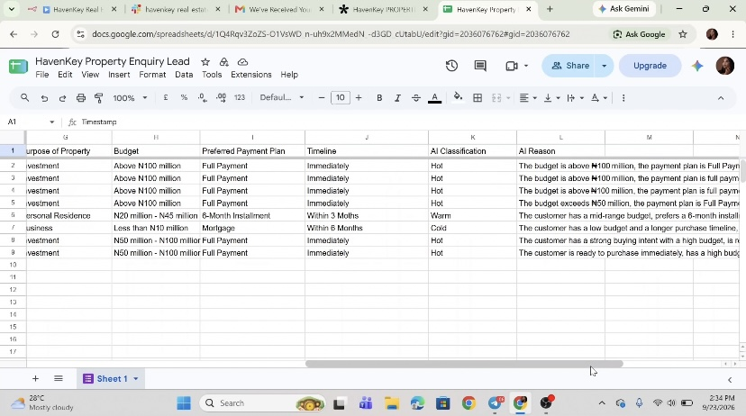
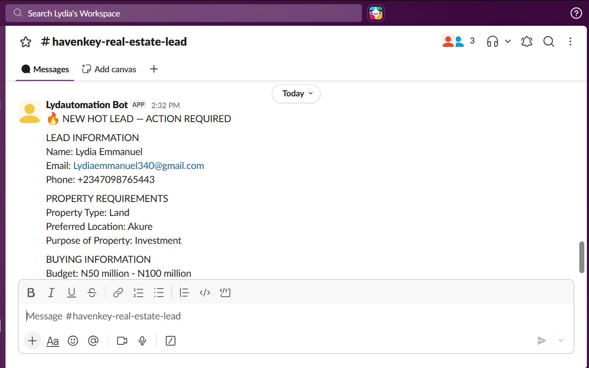
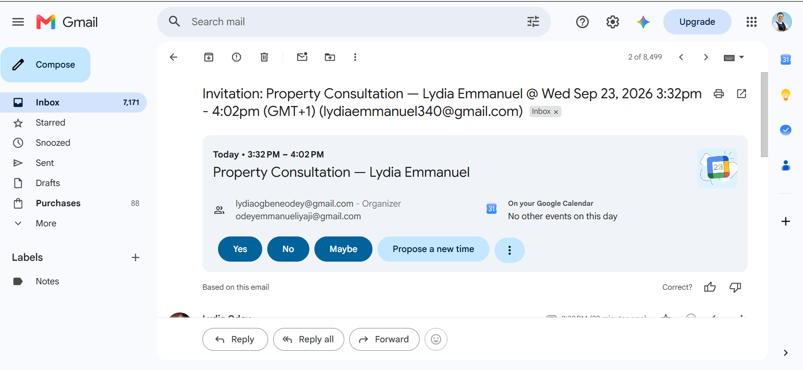
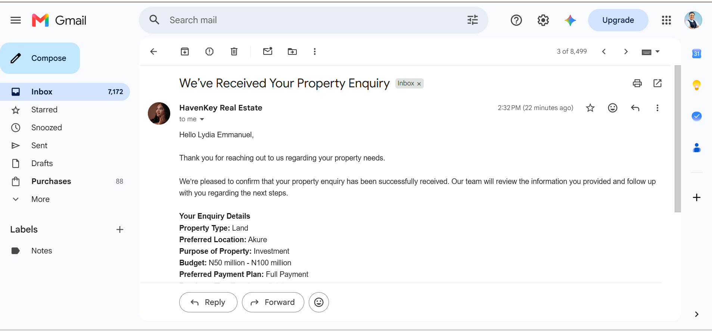

# HavenKey — Real Estate AI Lead Qualification & Follow-Up Workflow

HavenKey is an AI-powered real estate lead management workflow designed to help property sales teams capture enquiries, assess buying readiness, prioritize prospects, and automate follow-up.

The workflow uses AI to classify leads, route them based on buying readiness, notify the sales team, schedule property consultations, and send confirmation emails while keeping final sales decisions under human control.

## The Problem

Real estate businesses can receive many property enquiries from prospects at different stages of the buying journey.

Some prospects may be ready to buy, some may require follow-up, while others may still be exploring their options.

Reviewing every enquiry manually takes time. Sales teams need to examine prospect information, assess buying readiness, record the lead, decide who needs attention, and determine the appropriate next step.

This can make it harder to identify high-intent prospects quickly.

## The Solution

HavenKey automates the early stages of the real estate lead management process.

When a prospect submits an enquiry, the workflow records the information and uses AI to assess buying readiness.

The system recommends one of three lead categories:

- **HOT** — high buying readiness and requires timely sales attention
- **WARM** — interested but requires further follow-up
- **COLD** — currently better suited for nurturing

The AI also provides a reason for its recommendation.

Based on the recommended category, the workflow routes the lead to the appropriate path. Qualifying prospects can proceed to property consultation scheduling, while the sales team retains control over final sales decisions.

## Core Capabilities

- Capture property enquiries
- Record lead information automatically in Google Sheets
- Assess buying readiness using AI
- Classify leads as HOT, WARM, or COLD
- Provide a reason for each AI qualification
- Route leads based on their recommended category
- Notify the sales team through Slack when attention is required
- Schedule property consultations for qualifying prospects
- Send an automated confirmation email to the prospect
- Keep final sales decisions under human control

## How It Works

1. A prospect submits a property enquiry.
2. The prospect's information is recorded in Google Sheets.
3. AI analyzes the enquiry and assesses buying readiness.
4. The system recommends a HOT, WARM, or COLD classification and provides a reason.
5. The lead is routed based on the recommended category.
6. Leads requiring attention are sent to the sales team through Slack.
7. Qualifying prospects can have a property consultation scheduled in Google Calendar.
8. The prospect receives an automated confirmation email.
9. The sales team reviews the lead and retains control over the final sales decision.

## Project Screenshots

### Main Workflow Overview

The main n8n workflow manages the process from property enquiry and AI qualification to lead routing, consultation scheduling, and confirmation email.

### Property Enquiry Form

Prospects submit their property requirements and buying information through the enquiry form.

### Lead Records & AI Qualification

Lead information and AI qualification results are recorded in Google Sheets for tracking and review.

### Sales Team Notification

Leads requiring attention are sent to the sales team through Slack with the prospect's information and AI qualification recommendation.

### Property Consultation Scheduling

Qualifying prospects can have a property consultation scheduled in Google Calendar.

### Prospect Confirmation Email

After the enquiry is processed, the prospect automatically receives a confirmation email acknowledging that their enquiry has been received.

## Human-in-the-Loop Design

HavenKey supports the sales team rather than replacing human judgment.

AI helps assess buying readiness, recommend a lead category, explain the recommendation, and route the lead. The sales team remains responsible for final qualification, property discussions, negotiations, and sales decisions.

## Tech Stack

**Automation & Orchestration:** n8n  
**Lead Capture:** Online Enquiry Form  
**AI / LLM:** AI-powered lead analysis  
**Lead Records:** Google Sheets  
**Internal Notifications:** Slack  
**Consultation Scheduling:** Google Calendar  
**Confirmation Email:** Gmail

## Privacy & Data Handling

Public demonstrations and documentation for this project use fictional or test prospect information only.

No private customer information, API keys, authentication tokens, credentials, webhook secrets, or other sensitive information are included in the public project documentation.

---

**Built by Lydia Ogbene Odey**  
AI Automation Specialist | Health Tech Automation | Sales & CRM Automation
